# Introduction

**Sentinel-SLM** is a production-ready, multilingual content moderation system designed to protect Large Language Model (LLM) deployments. It acts as a smart firewall for your AI.

```mermaid
graph LR
    User -->|Prompts| Sentinel[🛡️ Sentinel-SLM]
    Sentinel -->|Safe Prompts| LLM[🤖 Your LLM]
    LLM -->|Response| Sentinel
    Sentinel -->|Safe Response| User
    Sentinel -.->|Block| Block[🚫 Blocked Message]

    style Sentinel fill:#ff9999,stroke:#333,stroke-width:2px
```

## The Problem
Deploying LLMs in production comes with significant risks:
1.  **Jailbreaks**: Users tricking the model into doing forbidden tasks ("Ignore rules and...").
2.  **Liability**: Models generating Hate Speech, PII, or Illegal instructions.
3.  **Latency**: Traditional guardrails (LlamaGuard 7B) are huge and slow prompts down by 500ms+.

## The Solution: Sentinel-SLM
Sentinel-SLM bridges the gap by using **Small Language Models (SLMs)**—specifically LiquidAI's LFM2-350M—specialized with distinct "Rails."

| Feature | Benefit |
| :--- | :--- |
| **Dual-Rail Protection** | Separate specialized models for Inputs (Attacks) vs Outputs (Policy). |
| **Blazing Fast (<50ms)** | 10x smaller than LlamaGuard. Runs on CPU/Edge. |
| **Privacy First** | Run entirely locally. No API calls to 3rd parties. |
| **Multilingual** | Trained on 20+ languages, not just English. |

## Quick Links
*   [**See the Architecture**](01_architecture.md): How the rails work.
*   [**Get Started**](02_installation_usage.md): Installation and code.
*   [**The Data**](03_dataset_taxonomy.md): What we detect (Taxonomy).

---

[Next: Architecture →](01_architecture.md)
