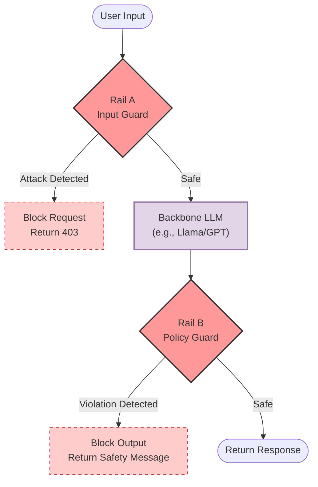
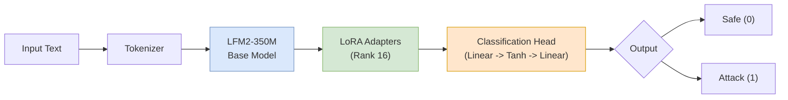

# Architecture

## Overview

Sentinel-SLM implements a **Dual-Rail Guardrail System** designed to protect Large Language Model (LLM) deployments from both malicious inputs and policy-violating outputs. The architecture consists of two specialized components working in tandem:

- **Rail A (Input Guard)**: Binary classifier for prompt injection/jailbreak detection.
- **Rail B (Policy Guard)**: Multi-label classifier for 8-category safety violations.

## model Registry

### Published Models (Hugging Face)

- **Rail A (Prompt Attack Guard)**: `abdulmunimjemal/Sentinel-Rail-A-Prompt-Attack-Guard`
- **Rail B (Policy Guard)**: `abdulmunimjemal/Sentinel-Rail-B-Policy-Guard`

### Local Artifacts

- **Rail A**: `models/rail_a_v3/final/`
- **Rail B**: `models/rail_b_v1/final/`

---

## System Architecture

Sentinel-SLM sits between your user and your LLM. It acts as a bidirectional firewall.

---

## Rail A: Input Guard

### Purpose

Detect and block prompt injection attacks, jailbreaks, and adversarial inputs **before** they reach the core LLM.

### Model Internals

Rail A is a 350M parameter transformer adapted with LoRA.

### Performance

| Metric       | Score      | Note                                                |
| :----------- | :--------- | :-------------------------------------------------- |
| **Accuracy** | **99.42%** | High reliability on benchmark attacks.              |
| **Recall**   | **99.83%** | Extremely low False Negative rate (missed attacks). |
| **Latency**  | **<50ms**  | CPU-friendly inference.                             |

---

## Rail B: Policy Guard

### Purpose

Detect policy violations in both user inputs and LLM outputs across 8 safety categories.

### Architecture

Rail B extends the same efficient 350M base with a **Multi-Label Classification Head**. Unlike Rail A (which is binary), Rail B outputs independent probabilities for 7 distinct categories.

> [!NOTE]
> **Why Multi-Label?**
> A single message can contain multiple violations (e.g., "Hate Speech" AND "Violence"). Our architecture detects all applicable tags simultaneously.

### Categories & Thresholds

Each category works independently. If _any_ category exceeds its threshold (default 0.5), the content is flagged.

| ID  | Category               | Description                                 |
| :-- | :--------------------- | :------------------------------------------ |
| 1   | **Hate & Extremism**   | Hate speech, discrimination, extremism      |
| 2   | **Harassment**         | Bullying, severe toxicity, personal attacks |
| 3   | **Sexual Content**     | NSFW, explicit sexual material              |
| 4   | **Child Safety**       | CSAM, exploitation, grooming                |
| 5   | **Violence**           | Gore, threats, self-harm                    |
| 6   | **Illegal Activities** | Drug trade, weapons, financial crimes       |
| 7   | **Privacy Violations** | PII leaks, doxxing                          |

_(Category 8 "Prompt Attack" is handled exclusively by Rail A)_

---

## Why Liquid Models (LFM2)?

Sentinel-SLM uses **LiquidAI LFM2-350M** models.

1.  **Edge-Native Efficiency**: Designed for efficient inference on CPU/NPU, making it cheaper to run than Llama-3-8B.
2.  **Hybrid Architecture**: Uses gated short-convolutions + attention, providing a sweet spot between transformer quality and RNN speed.
3.  **Performance**: Outperforms similar-sized BERT models on language understanding tasks.

---

[← Previous: Introduction](README.md) | [Next: Installation & Usage →](02_installation_usage.md)
