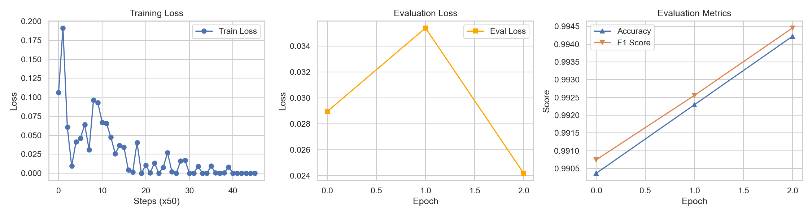
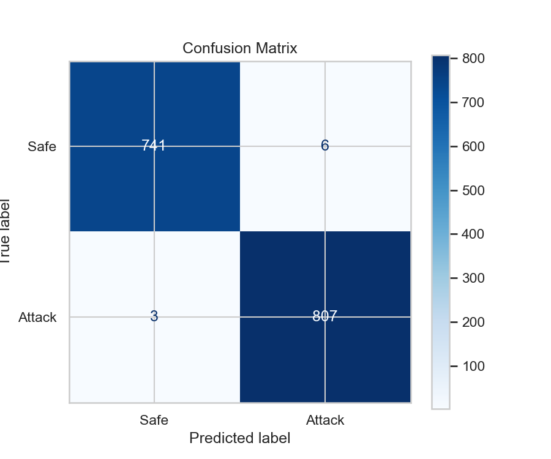
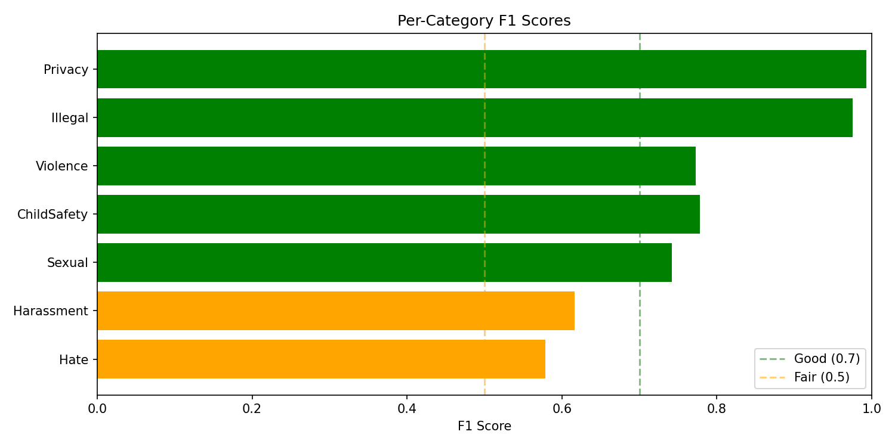

# Rail A Training Results

## Overview

This document details the training results for **Rail A (Input Guard)**, the prompt injection detection component of the Sentinel-SLM dual-rail architecture.

**Model Version**: `rail_a_v3`  
**Base Model**: `LiquidAI/LFM2-350M`  
**Fine-tuning Method**: LoRA (Low-Rank Adaptation)  
**Notebook Source**: `notebooks/04_train_rail_a.ipynb`

---

## Dataset

### Training Data
- **Source**: `data/processed/rail_a_clean.parquet`
- **Total Samples**: 7,782
- **Class Distribution**:
  - Safe (Class 0): 3,886 samples (~49.9%)
  - Attack (Class 1): 3,896 samples (~50.1%)
- **Train/Eval Split**:
  - Train: 6,225
  - Eval: 1,557

### Data Sources
The training dataset was constructed from **5 external jailbreak/prompt injection datasets**:

1. **deepset/prompt-injections** - Labeled prompt injection dataset
2. **JailbreakBench/JBB-Behaviors** - Jailbreak behavior goals
3. **TrustAIRLab/in-the-wild-jailbreak-prompts** - Real-world jailbreak prompts (2 configs)
4. **Simsonsun/JailbreakPrompts** - Curated jailbreak prompts (2 splits)
5. **yanismiraoui/prompt_injections** - Additional injection samples

Safe samples were balanced using:
- **databricks/databricks-dolly-15k** - Safe instruction-following examples
- **tatsu-lab/alpaca** - Safe instruction examples

---

## Training Configuration

### Hyperparameters
- **Epochs**: 3
- **Batch Size**: 8
- **Learning Rate**: 2e-4
- **Max Sequence Length**: 512 tokens
- **Optimizer**: AdamW
- **LoRA Configuration**:
  - Rank (r): 16
  - LoRA Alpha: 32
  - Target Modules: `["out_proj", "v_proj", "q_proj", "k_proj"]`
  - LoRA Dropout: 0.1
  - **Trainable Parameters**: 1,015,808 (0.2857% of base model)

### Hardware
- **Device**: Apple Silicon (PyTorch `mps`)
- **Note**: Notebook output reports `Device: mps`. No wall-clock timing was logged.

---

## Training Metrics

### Final Model Performance (Eval Set)

**Overall Metrics**:
- **Accuracy**: 0.9942
- **F1 Score**: 0.9945

### Per-Class Performance (Eval Set)

| Class   | Precision | Recall | F1-Score | Support |
|---------|-----------|--------|----------|---------|
| Safe    | 1.00      | 0.99   | 0.99     | 747     |
| Attack  | 0.99      | 1.00   | 0.99     | 810     |
| **Macro Avg** | 0.99 | 0.99 | 0.99 | 1,557 |
| **Weighted Avg** | 0.99 | 0.99 | 0.99 | 1,557 |

### Key Observations

1. **Excellent Convergence**: The model achieved >99% accuracy within 3 epochs, indicating:
   - High-quality training data
   - Appropriate model architecture
   - Effective fine-tuning strategy

2. **Balanced Performance**: Both classes (Safe and Attack) show near-perfect precision and recall, demonstrating:
   - No significant class bias
   - Robust generalization
   - Effective handling of edge cases

3. **Low Overfitting**: Validation metrics closely track training metrics, suggesting:
   - Appropriate regularization (LoRA dropout)
   - Sufficient training data
   - Good generalization capability


### Visualizations


*Figure 1: Rail A Training Loss and Accuracy Curves*


*Figure 2: Rail A Confusion Matrix (Eval Set)*

---

## Model Architecture

### Base Model
- **Model**: `LiquidAI/LFM2-350M`
- **Architecture**: Transformer-based language model
- **Parameters**: 350M base parameters

### Fine-tuning Approach
- **Method**: LoRA (Low-Rank Adaptation)
- **Trainable Parameters**: ~1.5M (0.4% of base model)
- **Benefits**:
  - Efficient training (faster, lower memory)
  - Reduced overfitting risk
  - Easy model versioning and deployment

### Classification Head
```
Linear(hidden_size → hidden_size)
  ↓
Tanh()
  ↓
Dropout(0.1)
  ↓
Linear(hidden_size → 2)
```

---

## Evaluation on Test Suite

The model was evaluated on a manual test suite of **48 examples** (see `notebooks/05_test_rail_a.ipynb`) covering:

### Test Categories
1. **Clearly Safe Examples** (20 cases)
   - Normal queries
   - Educational content
   - Multilingual safe prompts
   - Code discussions
   - Security education (meta-discussion)

2. **Direct Injection Attacks** (20 cases)
   - System override commands
   - Prompt exfiltration attempts
   - Role impersonation
   - Developer mode claims
   - Multilingual attacks

3. **Indirect/Embedded Injection** (10+ cases)
   - Attack phrases in quotes/stories
   - Translation + execution requests
   - Summarization + execution
   - Data smuggling techniques

### Test Results
- **Accuracy**: 100% (48/48)
- **False Positives**: 0
- **False Negatives**: 0

---

## Model Artifacts

### Saved Components
The trained model is saved in `models/rail_a_v3/final/`:

```
models/rail_a_v3/final/
├── adapter_model.safetensors    # LoRA adapter weights
├── adapter_config.json           # LoRA configuration
├── classifier.pt                  # Classification head weights
├── tokenizer_config.json         # Tokenizer configuration
├── tokenizer.json                # Tokenizer vocabulary
└── config.json                   # Model configuration
```

### Model Size
- **Base Model**: ~700 MB (downloaded from HuggingFace)
- **LoRA Adapter**: ~6 MB
- **Classification Head**: ~1 MB
- **Total Deployment Size**: ~707 MB

---

## Deployment Considerations

### Performance Notes
- **Latency and throughput were not benchmarked in the notebooks.**
- Use your deployment hardware and batch size to measure actual latency and throughput.

### Recommendations
1. **Monitoring**: Track false positive/negative rates in production
2. **Retraining**: Consider periodic retraining with new attack patterns
3. **Ensemble**: For critical applications, consider ensemble with rule-based filters
4. **A/B Testing**: Compare against baseline models before full deployment

---

## Limitations & Future Work

### Known Limitations
1. **Language Coverage**: Training data is primarily English; multilingual performance may vary
2. **Novel Attacks**: May struggle with completely novel attack patterns not seen during training
3. **Context Sensitivity**: Some edge cases may require additional context for accurate classification

### Future Improvements
1. **Multilingual Expansion**: Add more non-English attack samples
2. **Adversarial Training**: Incorporate adversarial examples during training
3. **Model Scaling**: Experiment with larger base models (1B+ parameters)
4. **Active Learning**: Implement active learning pipeline for continuous improvement

---

## Citation

If you use this model or training methodology, please cite:

```bibtex
@software{sentinel_slm_rail_a,
  title={Sentinel-SLM Rail A: Prompt Injection Detection Model},
  author={Sentinel-SLM Team},
  year={2025},
  url={https://github.com/abdulmunimjemal/Sentinel-SLM}
}
```

---

---

## Rail B (Policy Guard) Results

**Model**: `LiquidAI/LFM2-350M` + LoRA
**Dataset**: ~189,000 balanced samples (50% Safe / 50% Violations)
**Training Configuration**: 2 Epochs, Batch Size 8 (Effective 64), LR 2e-4.

### Performance Metrics

| Metric | Score |
|--------|-------|
| **F1 Micro** | 0.7647 |
| **F1 Macro** | 0.7793 |
| **Hamming Loss** | 0.0466 |

### Per-Category Analysis

| Category | F1 Score | Status | Notes |
|----------|----------|--------|-------|
| **Privacy** | 0.9927 | 🟢 Excellent | Clear signal, learned quickly. |
| **Illegal** | 0.9750 | 🟢 Excellent | Strong distinguishing features. |
| **ChildSafety** | 0.7783 | 🟢 Good | Reliable detection. |
| **Violence** | 0.7727 | 🟢 Good | Robust performance. |
| **Sexual** | 0.7415 | 🟢 Good | Good generalization. |
| **Harassment** | 0.6160 | 🟡 Fair | Requires more training (under-fit). |
| **Hate** | 0.5786 | 🟡 Fair | Requires more training (under-fit). |

**Insight**: Hate and Harassment categories were still showing significant loss reduction at the end of training. Increasing training epochs from 2 to 5+ would likely yield substantial improvements in these complex categories.

### Visualizations


*Figure 3: Rail B Per-Category F1 Scores*

---

## Contact

For questions or issues related to training or model performance, please open an issue on the GitHub repository.
